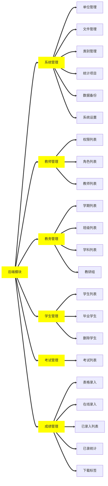

[TOC]

# 项目概述

# 项目概述

使用技术：`ThinkPHP` + `Bootstrap` + `Layui` + `Jquery`

版本:
`Jquery` :

`Bootstrap` : 4.5

`ThinkPHP` : 6.0.3

`X-admin` :2.

## 设计理念

-   MVC 支持-基于多层模型（M）、视图（V）、控制器（C）的设计模式
-   ORM 支持-提供了全功能和高性能的 ORM 支持，支持大部分数据库
-   模板引擎支持-内置了高性能的基于标签库和 XML 标签的编译型模板引擎
-   RESTFul 支持-通过 REST 控制器扩展提供了 RESTFul 支持，为你打造全新的 URL 设计和访问体验

## 安全性

-   XSS 安全防护
-   表单自动验证
-   强制数据类型转换
-   输入数据过滤
-   表单令牌验证
-   防 SQL 注入
-   图像上传检测

## 主要功能

### 业务模块



### 业务逻辑

### 数据库设计

#### `system_base`(系统基础表)

| 字段名 | 类型(长度) | 是否为空 | 默认值 | 注释 |
| :----: | :--------: | :------: | :----: | :--: |

#### `admin`( 管理员表 )

|  字段名  | 类型(长度)  |   是否为空   |           默认值            | 注释 |
| :------: | :---------: | :----------: | :-------------------------: | :--: |
|    id    |   int(10)   |     主键     |          自动编号           |
|   name   | varchar(10) |    用户名    |                             |
| password | varchar(10) |     密码     |          MD5 加密           |
|   role   |   tinyint   |     角色     | 0 普通用户 1 管理员，默认 0 |
|  ctime   |  datetime   | 记录创建时间 |         数据库时间          |

#### 权限表

|  字段名  |    类型     |     用途     |            注释             |
| :------: | :---------: | :----------: | :-------------------------: |
|    id    |   int(10)   |     主键     |          自动编号           |
|   name   | varchar(10) |    用户名    |                             |
| password | varchar(10) |     密码     |          MD5 加密           |
|   role   |   tinyint   |     角色     | 0 普通用户 1 管理员，默认 0 |
|  ctime   |  datetime   | 记录创建时间 |         数据库时间          |

#### 学生表

|  字段名  |    类型     |     用途     |            注释             |
| :------: | :---------: | :----------: | :-------------------------: |
|    id    |   int(10)   |     主键     |          自动编号           |
|   name   | varchar(10) |    用户名    |                             |
| password | varchar(10) |     密码     |          MD5 加密           |
|   role   |   tinyint   |     角色     | 0 普通用户 1 管理员，默认 0 |
|  ctime   |  datetime   | 记录创建时间 |         数据库时间          |

## 安装配置

```php
composer create-project topthink/think tp 6.0.*
```

### 模块安装

-   多应用模式:

```php
composer require topthink/think-multi-app
```

-   验证码:

```php
composer require topthink/think-captcha
```

-   数据库迁移工具:

```php
composer require topthink/think-migration
```

### 服务器配置

-   服务器配置

```php

```

### 模块更新

```php
composer update topthink/framework
```

## 版权信息
