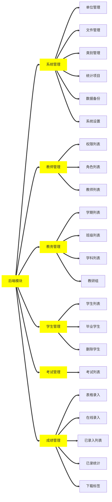

[TOC]

# 项目概述

使用技术：`ThinkPHP` + `Bootstrap` + `Layui` + `Jquery`

版本:
`Jquery` :

`Bootstrap` : 4.5

`ThinkPHP` : 6.0.3

`X-admin` :2.8

## 设计理念

-   MVC 支持-基于多层模型（M）、视图（V）、控制器（C）的设计模式
-   ORM 支持-提供了全功能和高性能的 ORM 支持，支持大部分数据库
-   模板引擎支持-内置了高性能的基于标签库和 XML 标签的编译型模板引擎
-   RESTFul 支持-通过 REST 控制器扩展提供了 RESTFul 支持，为你打造全新的 URL 设计和访问体验

## 安全性

-   XSS 安全防护
-   表单自动验证
-   强制数据类型转换
-   输入数据过滤
-   表单令牌验证
-   防 SQL 注入
-   图像上传检测

## 主要功能

### 业务模块



### 业务逻辑

### 数据库设计

#### `system_base`(系统基础表)

|    字段名    | 类型(长度)  | 是否为空 |                  默认值                   |       注释       |
| :----------: | :---------: | :------: | :---------------------------------------: | :--------------: |
|      id      |   int(10)   |          |                                           |  主键,自动编号   |
| system_title | string(60)  |  false   |               成绩管理系统                |     系统名称     |
|   keywords   | string(60)  |  false   |            录入,统计,查询,管理            |      关键词      |
| description  | string(100) |  false   |    成绩采集,成绩统计,成绩查询等功能。     |     网站说明     |
|    think     | string(80)  |  false   |   ThinkPHP,X-admin,百度 Echarts,jquery    |       致谢       |
|    danwei    | string(20)  |  false   |                 贵州贵阳                  |     使用单位     |
|  gradelist   | string(200) |  false   | 一年级,二年级,三年级,四年级,五年级,六年级 |     年级名称     |
|   classmax   |   int(2)    |  false   |                    30                     |     最大班级     |
|   xuenian    |   int(11)   |  false   |                 523206000                 |     学年节点     |
|  xueqishang  |   int(11)   |  false   |                 523206000                 |    上学年节点    |
|   xueqixia   |   int(11)   |  false   |                 523206000                 |    下学年节点    |
|  classalias  | boolean(1)  |  false   |                     0                     | 是否开启班级别名 |
| techerrongyu | boolean(1)  |  false   |                     0                     | 教师查看个人荣誉 |
|  techerketi  | boolean(1)  |  false   |                     0                     | 教师查看个人课题 |
|  studentfen  | boolean(1)  |  false   |                     0                     | 是否学生查看分散 |
|  creat_time  |   int(11)   |  false   |                1539158918                 |     创建时间     |
| update_time  |   int(11)   |  false   |                1539158918                 |     更新时间     |
| delete_time  |   int(11)   |   true   |                                           |     删除时间     |

#### `auth_group`(授权组表)

|   字段名    |  类型(长度)   | 是否为空 |   默认值   |         注释         |
| :---------: | :-----------: | :------: | :--------: | :------------------: |
|     id      |    int(10)    |          |            |    主键,自动编号     |
|    title    |  string(100)  |  false   | 测试用户组 | 用户组中文名称 ,唯一 |
|   rolues    | string(10000) |  false   |     0      | 用户组拥有的规则 ID  |
|   miaoshu   |  string(200)  |  false   | 测试用户组 |    用户组功能描述    |
|   status    |  boolean(1)   |  false   |    true    |      用户组状态      |
| create_time |    int(11)    |  false   | 1539158918 |       创建时间       |
| update_time |    int(11)    |  false   | 1539158918 |       更新时间       |
| delete_time |    int(11)    |   true   |            |       删除时间       |

#### `auth_group_access`(授权组访问表)

|   字段名    | 类型(长度) | 是否为空 |   默认值   |      注释      |
| :---------: | :--------: | :------: | :--------: | :------------: |
|     id      |  int(10)   |          |            | 主键 ,自动编号 |
|     uid     |  int(10)   |  false   |            |    用户 id     |
|  group_id   |  int(10)   |  false   |            |   用户组 id    |
| create_time |  int(11)   |  false   | 1539158918 |    创建时间    |
| update_time |  int(11)   |  false   | 1539158918 |    更新时间    |
| delete_time |  int(11)   |   true   |            |    删除时间    |

#### `auth_rule`(授权规则表)

|   字段名    | 类型(长度)  | 是否为空 |   默认值   |       注释        |
| :---------: | :---------: | :------: | :--------: | :---------------: |
|     id      |   int(10)   |          |            |   主键,自动编号   |
|    name     | string(80)  |  false   |     a      | 规则唯一标识,唯一 |
|    title    | string(80)  |  false   |     a      |   规则中文名称    |
|   status    | boolean(1)  |  false   |     1      |    用户组状态     |
|  condition  | string(100) |  false   |    true    |    规则表达式     |
|    paixu    |   int(11)   |  false   |    999     |       排序        |
|   ismenu    | boolean(1)  |  false   |     0      |    是否是菜单     |
|    font     | string(40)  |   true   |            |     菜单字体      |
|     url     | string(40)  |   true   |            |     菜单网址      |
|     pid     |   int(11)   |  false   |     0      |       父 id       |
| create_time |   int(11)   |  false   | 1539158918 |     创建时间      |
| update_time |   int(11)   |  false   | 1539158918 |     更新时间      |
| delete_time |   int(11)   |   true   |            |     删除时间      |

#### `admin`( 管理员表 )

|   字段名    | 类型(长度)  | 是否为空 |                默认值                 |           注释           |
| :---------: | :---------: | :------: | :-----------------------------------: | :----------------------: |
|     id      |   int(10)   |          |                                       |      主键 ,自动编号      |
|  xingming   | string(15)  |  false   |                   a                   |           姓名           |
|     sex     | boolean(1)  |  false   |                   2                   | 性别：0=女，1=男，2=未知 |
|   shengri   |   int(11)   |   true   |                                       |         出生日期         |
|  username   | string(20)  |   true   |                                       |      用户账号 ,唯一      |
|  password   | string(137) |  false   | $apr1$oz6tgaAl$ix4GBv0VxcnVJPIiodXUY/ |         登陆密码         |
|  techer_id  | string(11)  |   true   |                                       |         教师编号         |
|  school_id  |   int(11)   |  false   |                   0                   |         所在单位         |
|    phone    | string(11)  |   true   |                                       |      所在单位 ,唯一      |
|  worktimee  |   int(11)   |   true   |                                       |         工作时间         |
|  zhiwu_id   |   int(11)   |   true   |                                       |           职务           |
| zhicheng_id |   int(11)   |   true   |                                       |           职称           |
|    biye     | string(50)  |   true   |                                       |           毕业           |
|   zhuanye   | string(20)  |   true   |                                       |           专业           |
|  xueli_id   |   int(11)   |   true   |                                       |           学历           |
| subject_id  |   int(11)   |   true   |                                       |           学科           |
|   quanpin   | string(30)  |  false   |                   a                   |           全拼           |
|   shoupin   |  string(5)  |  false   |                   a                   |           简拼           |
|   tuixiu    | boolean(1)  |  false   |                   0                   |        是否已退休        |
| denglucishu |   int(5)    |  false   |                   0                   |         登录次数         |
|   lastip    | string(55)  |  false   |               127.0.0.1               |     最后一次登陆 ip      |
|     ip      | string(55)  |  false   |               127.0.0.1               |         登陆 ip          |
|  lasttime   |   int(11)   |  false   |                   0                   |     最后一次登陆时间     |
|  thistime   |   int(11)   |  false   |                   0                   |       本次登陆时间       |
|   status    | boolean(1)  |  false   |                   1                   |        用户组状态        |
| create_time |   int(11)   |  false   |              1539158918               |         创建时间         |
| update_time |   int(11)   |  false   |              1539158918               |         更新时间         |
| delete_time |   int(11)   |   true   |                                       |         删除时间         |
|   beizhu    | string(801) |   true   |                                       |           备注           |

#### `category`( 分类表 )

| 字段名 | 类型(长度) | 是否为空 | 默认值 |      注释      |
| :----: | :--------: | :------: | :----: | :------------: |
|   id   |  int(10)   |          |        | 主键 ,自动编号 |
| title  | string(50) |  false   |   a    |    类型标题    |
|  p_id  |  int(50)   |  false   |   0    |    父级 id     |
| status | boolean(1) |  false   |   1    |    父级 id     |

====================================================================================

## 安装配置

```php
composer create-project topthink/think tp 6.0.*
```

### 模块安装

-   多应用模式:

```php
composer require topthink/think-multi-app
```

-   验证码:

```php
composer require topthink/think-captcha
```

-   数据库迁移工具:

```php
composer require topthink/think-migration
```

### 服务器配置

-   服务器配置

```php

```

### 模块更新

```php
composer update topthink/framework
```

## 版权信息
